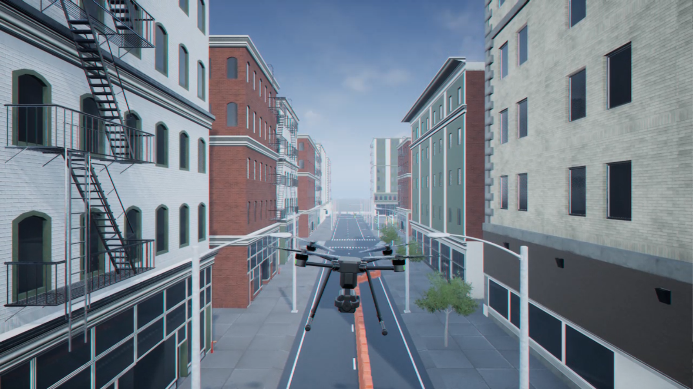

# Prerequisites

* Complete online training courses: [MATLAB Onramp](https://matlabacademy.mathworks.com/details/matlab-onramp/gettingstarted), [Simulink Onramp](https://matlabacademy.mathworks.com/kr/details/simulink-onramp/simulink) (These are essential as the workshop assumes basic knowledge of MATLAB and Simulink.)
* Install MATLAB R2026a on Windows OS
    * Visualization with Unreal Engine® is supported only in Windows.
    * Visualization will be replaced with cuboids in Mac or MATLAB Online environment.
* Required Toolboxes: MATLAB, Simulink, Aerospace Toolbox, Aerospace Blockset, UAV Toolbox, Simulink 3D Animation (If unsure, it's fine to install all toolboxes.)

# Big picture of the workshop

* Total time: 3 hour
* Purpose: 
    * To introduce broad idea of how Simulink can model dynamics systems of a quadcopter
    * Prerequisites: MATLAB/Simulink Onramp, MATLAB R2026a (Windows)
    * Final Result: Modeling and Simulating quadcopter with PID Control

