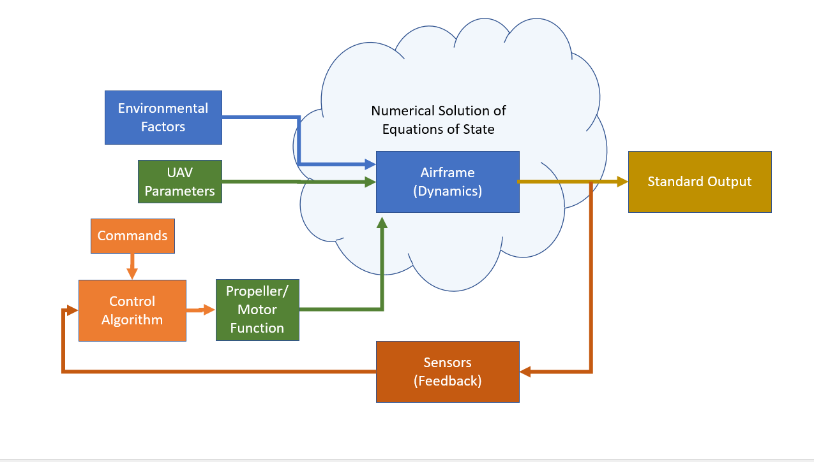
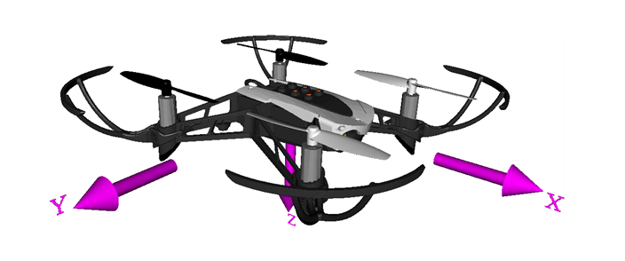

# Quadcopter UAV Model Introduction / Big Picture
<!-- Begin Toc -->

## Table of Contents
&emsp;[Motivation:](#H_92584701)
 
&emsp;[Our Quadcopter UAV](#H_88059314)
 
&emsp;&emsp;[Quadcopter Ubitquity](#H_FB5678DD)
 
&emsp;&emsp;[Prime Example for Model\-based Design](#H_5FE87281)
 
&emsp;[Introduction](#H_E3C05E16)
 
&emsp;&emsp;[Framework](#H_1F7DDD9F)
 
&emsp;&emsp;[Lesson Approach:  Interatively Build up Airframe *(along with Elements of Controller and Environment for Context)*](#H_C225005F)
 
&emsp;&emsp;[Lesson Objective](#H_6A3939A3)
 
&emsp;&emsp;[Tactical Plan](#H_A6EC67BF)
 
&emsp;[Contents](#H_BCDFF6B2)
 
&emsp;[Our UAV](#H_50CD486D)
 
&emsp;[Glossary of Terms](#H_1C121E05)
 
&emsp;[Lesson Files](#H_84D1FFB0)
 
<!-- End Toc -->

# Motivation:

# Our Quadcopter UAV

## Quadcopter Ubitquity

Quadcopters are ubitquitos today.    You see them, cameras carefully mounted, at every outdoor sporting event to capture a view of the game from the sky.   Simularly, they are commonplace in movie and television production.   They are also used, equipped with IR cameras, by electric power utilities to inspect the health of transmission lines and plans are underway to have them provide the delivery of small packages to individual homes.   This is a testimony to both their capability and their reliability.    Quadcopters also are great tools to learn about control systems.  Engineers have to design the algorithms to enable operators to pilot them.   The motion of the quadcopter is controlled by the angular velocity the propellers spin.   The engineer has four independent propellers to control and needs to be able to control all six degrees of freedom (3 spatial coordinates and 3 orientation coordinates).  The problem is just complicated enough to make it non\-trivial, but not so complicated to place it beyond the grasp of a student of control systems.

## Prime Example for Model\-based Design

Quadcopters are a perfect example of a design problem that easily lends itself to modeling.    The engineer can build up models of the equations of motion, the control system, the environmental forces, and the sensor systems separately and then integrate them together.   As the need for greater precision in one element occurs.

# Introduction

Welcome to the MATLAB lesson on the UAV Airframe Model.   This lesson is prepared by California State University and MathWorks and is designed to help students understand and construct a simple UAV airframe model.   The MATLAB LiveScript lesson is the first of a four part series about UAV models:

-  Airframe Model 
-  Quadcopter Model 
-  Quadcopter Control 
-  PID Tuning 

Each of these lessons will contain a set of MATLAB LiveScript modules followed by a video lesson developing the corresponding part of a Simulink model.   In the end, you will be able to assemble a Simulink model of a UAV of your own and will have an appreciation of the underlying physics and numerical calculations that compose the model.

## Framework

Developing a UAV model and testing it along the way requires several parts working together.   The framework for this model is captured in the following figure.

## Lesson Approach:  Interatively Build up Airframe *(along with Elements of Controller and Environment for Context)*

You will start by building up the Airframe model, but it is necessary to have inputs about the UAV, the environment, and the control system as input to give this airframe context and to test your model.    Likewise the output of the model and any feedback through the UAV sensor systems is critically important for assessment.   Of course, you cannot master all of these parts simultaneously, so the approach will to start with simple input parameters, develop the Airframe model, and display the results in a intuitive way.   Then slowly each of the elements in the system will evolve as the Airframe model evolves, so that  the features are readily understood and the model performance is validated.

## Lesson Objective

In this lesson you will learn how to model the flight dynamics of a simple UAV.   At the end of the lesson you will be able to:

-  Model a UAV that can move through the air, and can rotate about its CoM. 
-  Assemble a Simulink model of this UAV airframe that includes the vehicle, gravity and drag forces 
-  Understand the UAV dynamics sufficiently so that, in a subsequent lesson, you can confidently build a controller for it. 

You will also be introduced to a state space representation of a UAV model and you will be shown how to interpret plots of the state space as a function of time.   These items will foundational as you progress through the entire four\-part series.

## Tactical Plan

Your first lesson is divided into two major parts.  In the first part, you will use LiveScript to develop, step by step, a MATLAB model of the UAV airframe.  The second major part includes a video lesson to demonstrate how you can assemble a corresponding UAV airframe model in Simulink.   The development of your Livescript model will be done in a few short parts, each with its own LiveScript file.

# Contents

This LiveScript lesson contains the following parts.  Each part contains multiple LivesScript lessons.

-  Part 0.  Introduction 
-  Part 1.  Motion in X\-Y\-Z and Newtonian Dynamics 
-  Part 2.  Rotations and Six Degrees of Freedom (6DOF) 
-  Part 3.  Equations of Motion in 6DOF;  Euler's Formulation 

The Livescript lessons are accompanied by a video lesson:

-  Part 4.  Building a UAV Airframe Model in Simulink 

# Our UAV

# Glossary of Terms

Some key terms and phrases you will find throughout the lesson are listed here.

-  UAV:   An unmanned aerial vehicle.   In this lesson focus will be on a quadcoptor. 
-  Inernial Frame:   A fixed reference frame.  In this lesson, as the UAV flies at relatively low altitudes, the focus will be the flat Earch reference frame. 
-  Position in Inertial Frame.   A three\-element vector $X_e =\left\lbrack x\;,y,z\right\rbrack$ referencing a user\-specified origin. 
-  Velocity in Inertial Frame.  A three\-element vector $V_e =\left\lbrack v_x \;,v_y \;,v_z \right\rbrack$ representing the velocity in the inertial (Earth) frame. 
-  Body Frame.   A reference frame, defined with respect to the UAV body.  The origin of this frame is the center of mass (CoM) of the UAV.    
-  Euler Rotation Angles.   A three\-element vector of angles, $\left\lbrack \phi \;,\theta \;,\psi \right\rbrack$ which are called, respectively, roll, pitch and yaw, and measure the angles about the axes in the Body frame. 
-  Body Rotation Rates.  A three\-element vector of rates of change, $\left\lbrack p\;,q\;,r\;\right\rbrack$, of the Euler rotation angles. 

Note:   A good reference for the coordinate system can be found at:

[About Aerospace Coordinate Systems \- MATLAB & Simulink (mathworks.com)](https://www.mathworks.com/help/aeroblks/about-aerospace-coordinate-systems.html)

# Lesson Files

The following files compose the first part of this lesson.  They can be found on: 

-  MathWorks File Exchange:      UAV\_Quadcopter\_Lessons\-UAV\_05\_Appendix 
-  Github:    https://github.com/mathorburn/UAV\_Quadcopter\_Lessons/UAV\_05\_Appendix 

**Introduction**

&nbsp;&nbsp;&nbsp;&nbsp; Lesson\_AF\_00\_Intro.mlx     (This file)

-  Your introduction to the lesson 

&nbsp;&nbsp;&nbsp;&nbsp; Lesson\_AF\_01\_3DOF\_Projectile.mlx 

-  This LiveScript addresses the first part of your lesson on Airframes with the introduction of a three\-degree\-of\-freedom projectile. 

&nbsp;&nbsp;&nbsp;&nbsp; Lesson\_AF\_02\_FlatEarth\_ParametricDisplays.mlx

-  This LiveScript continues with the development of your lesson on Airframes and discusses the standard Flat\-Earth inertial reference frame and a useful and standard way of parametrically displaying your state output. 

&nbsp;&nbsp;&nbsp;&nbsp; Lesson\_AF\_03\_StateSpaceModel.mlx

-  This LiveScript continues with the development of your lesson on Airframes and includes the introduction of the state space formulation of your model. 

&nbsp;&nbsp;&nbsp;&nbsp; Lesson\_AF\_04\_EnvironmentalForces.mlx

-  This LiveScript continues with the development of your lesson on Airframes and includes the introduction of environmental forces that impact the flight of your UAV. 

&nbsp;&nbsp;&nbsp;&nbsp; Lesson\_AF\_05\_AltitudeHover\_and\_FeedForward.mlx

-  This LiveScript continues with the development of your lesson on Airframes and includes the introduction a simple model for hovering your UAV at a given altitude. 

&nbsp;&nbsp;&nbsp;&nbsp; Lesson\_AF\_06\_AltitudePDFF\_Controller\_3DOF.mlx

-  This LiveScript continues with the development of your lesson on Airframes and includes the a simple altitude controller so that you can command your UAV to a desired altitude. 

&nbsp;&nbsp;&nbsp;&nbsp; Lesson\_AF\_07\_Summary\_3DOF.mlx

-  This LiveScript summarizes the elementary motion and Newtonian dynamics covered thus far in your module. 

**Rotations and Motion with Six Degrees of Freedom / Equations of Motion \- Eulers Formulation**

&nbsp;&nbsp;&nbsp;&nbsp; Lesson\_AF\_08\_BodyFrameReference\_and\_Rotation.mlx 

-  This LiveScript discusses the six\-degree\-of\-freedom model (6DOF) and introduces the topic of Rotation Matrices. 

   Lesson\_ AF\_09\_EquationsOfMotion\_6DOF.mlx

-  This LiveScript introduces the equations of motion for the 6\-degree\-of\-freedom UAV. 

&nbsp;&nbsp;&nbsp;&nbsp; Lesson\_AF\_10\_AtltiudePDFF\_Controller\_6DOF

-  This LiveScript shows you how to add some simple forces to your 6DOF UAV model to make it more useful. 
