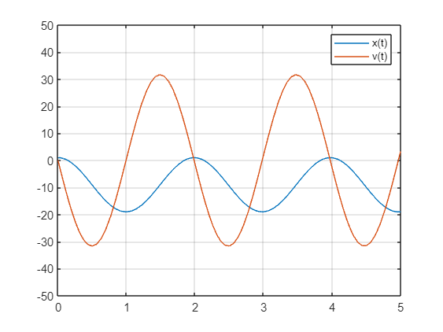
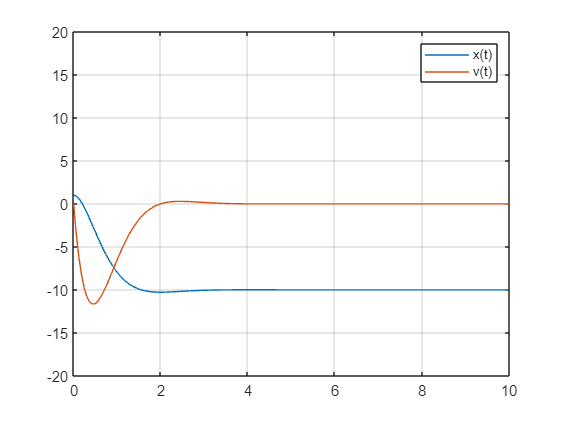

<a id="T_436085C1"></a>

# Quadcopter Control
<!-- Begin Toc -->

## Table of Contents
&emsp;[Learning Goals](#H_286B18B7)
 
&emsp;[Introduction](#H_2B2C3656)
 
&emsp;[PID control](#H_2925FA4F)
 
&emsp;&emsp;[Brief background on control theory](#H_5C5AA500)
 
&emsp;&emsp;[Describe the plant/control system (using a diagram)](#H_EDC4029B)
 
&emsp;&emsp;[The PID controller equations](#H_8BC4F48E)
 
&emsp;[Quadcopter Altitude PID control](#H_2F5F2020)
 
&emsp;&emsp;[PID Control \- Controlling z\-motion on Quadcopter](#H_1A8EBFF2)
 
&emsp;&emsp;&emsp;[Exercise:](#H_09406409)
 
&emsp;&emsp;[Proportional Control (to control position)](#H_F418CA9F)
 
&emsp;&emsp;[Derivative Control (to control velocity)](#H_042F2DEC)
 
&emsp;&emsp;[Integral Control (to help adjust steady state bias)](#H_6D98AAB8)
 
&emsp;&emsp;&emsp;[Exercise](#H_76D38727)
 
&emsp;[Quadcopter Altitude Feed\-Forward + PD Control](#H_7B7C77DB)
 
&emsp;&emsp;[Purpose of Integral Control](#H_F6070609)
 
&emsp;&emsp;[Replacing Integral Control with Feed\-Forward Control](#H_80B9F8B0)
 
&emsp;&emsp;[Exercise](#H_DEA32C86)
 
&emsp;[Attitude Control and the Motor Mixing Algorithm](#H_066B7353)
 
&emsp;&emsp;[Steps to Control Pitch, Roll, and Yaw](#H_C003A4C3)
 
&emsp;[Building the Quadcopter Control Model in Simulink](#T_436085C1)
 
&emsp;&emsp;[Further practice](#H_C0828472)
 
<!-- End Toc -->
<a id="H_286B18B7"></a>

# Learning Goals

After completing this module the student will be able to

-  List the components of a feedback loop control system 
-  Explain the basic function of a PID controller 
-  Add PID controllers to a Simulink model 
-  Use PID control to obtain desired motions, such as hover and forward motion 
-  Evaluate robustness of PID control under external forcing 

<a id="H_2B2C3656"></a>

# Introduction

This is the module where everything comes together!     You started by understand the Airframe, which captured the physics and equations of motion.   With applied forces and torques in the presence of environmental parameters, you were able to calculate all of the state variables, and thereby describe the motion of the vehicle.   Then you added some of the details of the quadcopter so that you could compute these same state variables with by taking propeller velocities and determining the resulting forces and torques.   That describes all of the hardware in the acuator chain.    In this module, you will develop the software which makes up the control algorithm.   The input will be commanded states and measurements of the actual state and the output will be the propeller velocity commands you send to the motors.


This is not to say that this will be your final model refinement.   There will remain work to do in modeling the sensors, you may need to add additional environmental terms, or refine your motor function to capture hardware non\-linearities.    Still, the essential model will be complete and can serve as a basis for all of the further developments.

<a id="H_2925FA4F"></a>

# PID control
<a id="H_958BB04A"></a>

As was discussed in the preliminary lesson on feedback control, the PID controller (Proportional, Integral, and Derivative) is a workhorse in many control problems.   

<a id="H_5C5AA500"></a>

## Brief background on control theory
<a id="H_D8C27BF9"></a>
<a id="H_EDC4029B"></a>

## Describe the plant/control system (using a diagram)

When learning about control systems and being introduced to the concepts of a plant, a controller and the state, you will have seen a block diagram like the one below.


The similarity to our model block diagram is not a coincidence.   Our Plant is what we have called, the Quadcopter.  It is the composition of the propeller/motor function with the airframe and dynamics.   This is the physical part of our system.   

<a id="H_73059693"></a>
<a id="H_8BC4F48E"></a>

## The PID controller equations 

The PID control has three parallel elements.   The proportional term, the integral term, and the derivative term.   This is portrayed in the block diagram below.


The proportional term drive the state variable y, to its desired value as defined by the command.    The derivative term helps prevent overshooting.    The integral term is necessary to account for the steady state controller output that is required once the desired state is achieved.     


In the time domain, the result is that the controller output is $y=k_p \;u\left(t\right)+k_i \int u\left(t\right)\;\textrm{dt}+k_d \frac{\mathrm{d}}{\mathrm{d}t}u\left(t\right)$ 

<a id="H_2F5F2020"></a>

# Quadcopter Altitude PID control

In your  control, your steady\-state is a hovering quadcopter in a windless environment.   You know that in this case, the force that you must compensate in steady state is that due to gravity.   

<a id="H_1A8EBFF2"></a>

## PID Control \- Controlling z\-motion on Quadcopter
<a id="H_C4510F3D"></a>

To illustrate the idea of PID control, consider the vertical motion of a quadcopter flight.   That is, consider moving the quadcopter solely in altitude.     In this example, you can assume the the quadcopter is level to the ground and so gravity is directed in the +z axis of the body frame of the quadcopter.


Consider this configuration, subject only to the force of gravity and an applied force F created by the propellers of the quadcopter, the equation of motion becomes:


 $$ m\frac{{\mathrm{d}}^2 }{\mathrm{d}t^2 }z\left(t\right)=\textrm{mg}+F $$ 


with initial conditions: $z\left(0\right)=1$ and $\frac{\mathrm{d}}{\mathrm{d}t}z\left(t=0\right)=0$ 


```matlab
x0=1;v0=0;m=0.1;g=9.81;

F=0;    % start with no applied force - the quadcopter will fall due to the force of gravity

dxdt=@(t,x,v)v;
dvdt=@(t,x,v)g+F/m;
dzdt=@(t,z)[dxdt(t,z(1),z(2));dvdt(t,z(1),z(2))];
z0=[x0;v0];tspan=[0,5];

[t,z]=ode45(dzdt,tspan,z0);
plot(t,z);grid on;legend('x(t)','v(t)');axis([tspan,-50,50])
```


If the force F is zero, the quadcopter falls off the chart as a result of gravity.      You need a non\-zero applied force to compensate for gravity!

<a id="H_09406409"></a>

#
## Exercise:

Adjust the magnitude of the Force so that the quadcopter achieves a desired altitude of \-10 meters in 2 seconds (remember that z points down, so an altitude of \-10 meters is 10 meters above the ground.).

```matlab
F=-1.42;
dxdt=@(t,x,v)v;
dvdt=@(t,x,v)g+F/m;
dzdt=@(t,z)[dxdt(t,z(1),z(2));dvdt(t,z(1),z(2))];

[t,z]=ode45(dzdt,tspan,z0);
plot(t,z);grid on;legend('x(t)','v(t)');axis([tspan,-50,50])
```


If you are careful, you can achieve this objective, but the quadcopter keeps accelerating and again, shoots past any target.

<a id="H_F418CA9F"></a>

## Proportional Control (to control position)

Suppose you want to fly to, at remain at, the position  $x_{\textrm{desired}}$       Add Proportional Control!


That is, add a forcing function that is proportional to the position error.

 $$ F_p =mk_p \left(z_{\textrm{desired}} -z\right) $$ 

so

 $$ m\frac{{\mathrm{d}}^2 }{\mathrm{d}t^2 }z\left(t\right)=\textrm{mg}+F_p $$ 
```matlab
kp=10; xd=-10;

dxdt=@(t,x,v)v;
dvdt=@(t,x,v)g;
dzdt=@(t,z)[dxdt(t,z(1),z(2));dvdt(t,z(1),z(2))];
Fp=@(t,z)[0;m*kp*(xd-z(1))];
dzdt2=@(t,z)dzdt(t,z)+Fp(t,z)/m;

[t,z]=ode45(dzdt2,tspan,z0);
plot(t,z);grid on;legend('x(t)','v(t)');axis([tspan,-50,50]);
```



This time the quadcopter does not fly off the chart, but it does not reach a steady value at the desired altitude.   In fact, it is always at a peak velocity as it zooms past the desired altitude.

<a id="H_042F2DEC"></a>

## Derivative Control (to control velocity)

Suppose you want the reduce the overshoot as you approach steady state.   Add Derivative Control!


That is, add a forcing function that is proportional to the derivative of the position error.

 $$ F_d ={\textrm{mk}}_d \frac{\mathrm{d}}{\mathrm{d}t}\left(z_{\textrm{desired}} -z\right)=mk_d \left(0-v\right) $$ 

so

 $$ m\frac{{\mathrm{d}}^2 }{\mathrm{d}t^2 }z\left(t\right)=\textrm{mg}+F_p +F_d $$ 
```matlab
kd=20; 

Fd=@(t,z)[0;m*kd*(0-z(2))];
dzdt3=@(t,z)dzdt2(t,z)+Fd(t,z)/m;

[t,z]=ode45(dzdt3,tspan,z0);
plot(t,z);grid on;legend('x(t)','v(t)');axis([tspan,-50,50]);
```


<a id="H_C150CC0A"></a>

**Zoom In**

<a id="H_497D82DF"></a>
```matlab
tspan=[0,10];
[t,z]=ode45(dzdt3,tspan,z0);
plot(t,z);grid on;legend('x(t)','v(t)');axis([tspan,-50,50]);
```


```matlab
plot(t,z);grid on;legend('x(t)','v(t)');axis([tspan,-20,20]);
```


<a id="H_6D98AAB8"></a>

## Integral Control (to help adjust steady state bias)

Fix bias error.  Add Integral Control!


That is, add a forcing function that is proportional to the integral of the position error.

 $$ F_i =mk_i \int_0^t \left(z_{\textrm{desired}} -z\right)\textrm{dt}=mk_i \left(z_{\textrm{desired}} \;t-\int_0^t z\left(t\right)\textrm{dt}\right) $$ 


so

 $$ m\frac{{\mathrm{d}}^2 }{\mathrm{d}t^2 }z\left(t\right)=\textrm{mg}+F_p +F_d +F_i $$ 


(To do this, we will create a system of three variables: 


 $s\left(t\right)=\int_0^t z\left(t\right)\textrm{dt}$   ,  $x\left(t\right)$  ,  and $v\left(t\right)=\frac{\mathrm{d}}{\mathrm{d}t}z\left(t\right)$ 


```matlab
kp=10;kd=10;ki=10;
w0=0;

dsdt=@(t,s,x,v)x;
dxdt=@(t,s,x,v)v;
dvdt=@(t,s,x,v)g;
dzdt=@(t,z)[dsdt(t,z(1),z(2),z(3));dxdt(t,z(1),z(2),z(3));dvdt(t,z(1),z(2),z(3))];
z0=[w0;x0;v0];tspan=[0,10];

dzdt4=@(t,z)dzdt(t,z)+[0;0;kp*(xd-z(2))+kd*(0-z(3))+ki*(xd*t-z(1))]
```

```matlabTextOutput
dzdt4 = function_handle with value:
    @(t,z)dzdt(t,z)+[0;0;kp*(xd-z(2))+kd*(0-z(3))+ki*(xd*t-z(1))]

```

```matlab

[t,z]=ode45(dzdt4,tspan,z0);
%plot(t,z);grid on;legend('i(t)','x(t)','v(t)');axis([tspan,1,3])
plot(t,z(:,2),t,z(:,3));grid on;legend('x(t)','v(t)');axis([tspan,-20,20]);
```


<a id="H_76D38727"></a>

#
## Exercise
<a id="H_91522CBA"></a>

Adjust the coefficients to achieve a reasonable profile to achieve your desired altitude.

```matlab
kp=9.9;
kd=9.8;
ki=1.3;

w0=0;
dsdt=@(t,s,x,v)x;
dxdt=@(t,s,x,v)v;
dvdt=@(t,s,x,v)g;
dzdt=@(t,z)[dsdt(t,z(1),z(2),z(3));dxdt(t,z(1),z(2),z(3));dvdt(t,z(1),z(2),z(3))];
z0=[w0;x0;v0];tspan=[0,10];

dzdt4=@(t,z)dzdt(t,z)+[0;0;kp*(xd-z(2))+kd*(0-z(3))+ki*(xd*t-z(1))];
```

```matlabTextOutput
dzdt4 = function_handle with value:
    @(t,z)dzdt(t,z)+[0;0;kp*(xd-z(2))+kd*(0-z(3))+ki*(xd*t-z(1))]

```

```matlab

[t,z]=ode45(dzdt4,tspan,z0);
%plot(t,z);grid on;legend('i(t)','x(t)','v(t)');axis([tspan,1,3])
plot(t,z(:,2),t,z(:,3));grid on;legend('x(t)','v(t)');axis([tspan,-20,20]);
```


<a id="H_7B7C77DB"></a>

# Quadcopter Altitude Feed\-Forward + PD Control
<a id="H_F6070609"></a>

## Purpose of Integral Control

In the previous section you saw that the addition of the integral controller resulted in correcting for the offset in the desired position that you saw when using solely a proportional and derivative control (PD control).    In fact, for this simple quadcopter configuration, a PD control by itself would never work to achieve and maintain the altitude you desire.


The equation of motion in this case is:

 $$ m\frac{{\mathrm{d}}^2 }{\mathrm{d}t^2 }z\left(t\right)=\textrm{mg}+F_p +F_d $$ 


or


 $$ \frac{{\mathrm{d}}^2 }{\mathrm{d}t^2 }z\left(t\right)=g+k_p \left(z_{\textrm{desired}} -z\right)+k_d \left(0-v\right) $$ 


so, if you have achieved your desired altitude and have zero velocity, then the force of gravity will immediately accelerate your quadcopter back towards the ground (in the positive z direction).    The integral control term allowed you to overcome this.

<a id="H_80B9F8B0"></a>

## Replacing Integral Control with Feed\-Forward Control

In your simple altitude controller, the integral control term is replaced by a feed\-forward term.   This directly compensates for gravity.   The result is only a little different.    It has some nice properties that are beyond the scope of this discussion, but essentially, by compensating for gravity, you can design your PD control system in an almost linear realm.


<a id="H_C61F4414"></a>
<a id="H_6D695C2C"></a>
<a id="H_14257185"></a>
<a id="H_9E5EB47C"></a>
<a id="H_44882928"></a>
<a id="H_20076530"></a>
<a id="H_DEA32C86"></a>

## Exercise

Adjust the porportional and derivative control values to achieve a hover at the altitude of \-10 meters.    How fast can the altitude be achieved without flying past it.    How fast can 

```matlab
z0=1;v0=0;m=0.1;g=9.81;
xd=-10;
kp=5.9;
kd=3.7;

tspan=[0,10];

dxdt=@(t,x,v)v;
dvdt=@(t,x,v)g;
dzdt=@(t,z)[dxdt(t,z(1),z(2));dvdt(t,z(1),z(2))];
Fp=@(t,z)[0;m*kp*(xd-z(1))];Fd=@(t,z)[0;m*kd*(0-z(2))];F_ff=[0;-m*g];
dzdt5=@(t,z)dzdt(t,z)+Fp(t,z)/m+Fd(t,z)/m+F_ff/m;

[t,z]=ode45(dzdt5,tspan,[z0;v0]);
plot(t,z);grid on;legend('x(t)','v(t)');axis([tspan,-20,20]);
```


<a id="H_066B7353"></a>

# Attitude Control and the Motor Mixing Algorithm

Now that you can control your altitude with a PD+FF controller, the next step is to understand how to control the attitude.   There are four motors on a quadcopter and between altitude and attitude, there are four independent motions.   That is everything you can control.    (Your quadcopter will move in the X\-Y directions by controlling the roll, pitch,and yawl commands.)    So the control algorithm needs to be written consistent with your system architecture.


You will issue commands for Thrust, Roll, Pitch and Yaw.   You will use those commands, along with feedback about the state of the system to create a desired propeller velocities.

<a id="H_C003A4C3"></a>

## Steps to Control Pitch, Roll, and Yaw

The steps that you must implement to control the attitude (pitch, roll and yaw) of your quadcopter UAV are:

-  Implement the Motor Mixing Algorithm (Matrix) discussed in the last lesson 
-  Implement PD controls for Pitch, Roll and Yaw (along with the FF+PD control you have already implemented for Thrust) using feedback of the state of the system 

In this case, you are using a PD control because you are designing your system about the nominal position of a steady hover.   Once the drone has achieved a steady hover, the nominal values for each of the torques is zero.

<a id="H_684BE1E3"></a>

# Building the Quadcopter Control Model in Simulink

Based on the plan presented in the beginning of the lesson, you want to change the inputs so that they are commanded thrust, roll, pitch and yaw.  The control algorith will use PD controls to create the desired propeller velocities as input to your quadcopter model from the last lesson.


Steps:

<a id="H_1F7C6E74"></a>
-  Open the completed quadcopter model from the end of the previous module 
-  Create a Motor Mixing Matrix to convert desired Thrust, Roll, Pitch and Yaw into propeller speeds 
-  Create a FF+PID controller for Thrust, set $k_p =1$ and $k_d =2$ 
-  Create a PID controller for Yaw, set $k_p =1$ and $k_d =2$ 
-  Create a PID controller for Pitch, set $k_p =1$ and $k_d =2$ 
-  Create a PID controller for Roll, set $k_p =1$ and $k_d =2$ 
<a id="H_DB070682"></a>
```matlab
% Simulink Exercise
```
<a id="H_7FB0AA26"></a>
<a id="H_C0828472"></a>

## Further practice
<a id="H_760F6876"></a>

Run the model to hover, then turn on the external forcing and see if the model continues to hover (have some forcing hit from the side so that only part of the motion is accounted for)

<a id="H_ED3EB3E8"></a>
```matlab
% Simulink Exercise
```

<a id="H_810B5223"></a>
