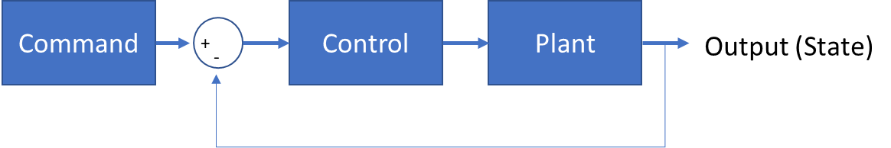
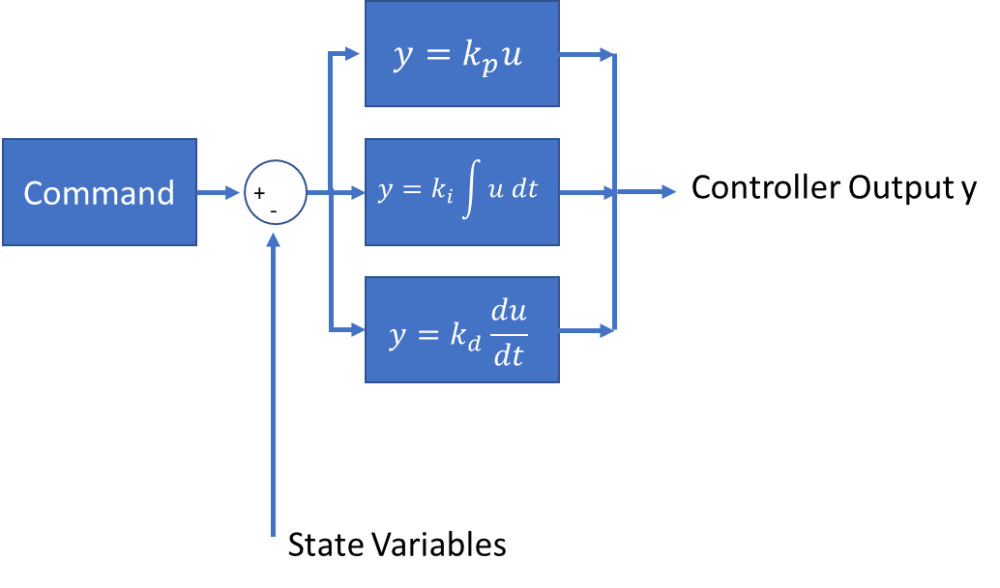
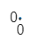
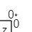
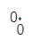
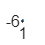
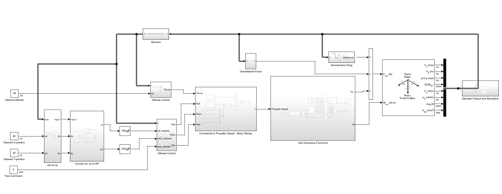

<a id="T_07371497"></a>

# PID Tuning
<!-- Begin Toc -->

## Table of Contents
&emsp;[Learning Goals](#H_724E5B28)
 
&emsp;[PID tuning background](#H_B0C2BDD2)
 
&emsp;&emsp;[Advantages/disadvantages of each each element of PID control (P, I, and D respectively).](#H_1FABE022)
 
&emsp;&emsp;&emsp;[Review the plant/control system (using a diagram)](#H_1833BBD0)
 
&emsp;&emsp;[The PID controller equations](#H_8BC4F48E)
 
&emsp;&emsp;[Examples and Essential tradeoffs](#H_8B077947)
 
&emsp;&emsp;&emsp;[P\-Control](#H_6BE85B33)
 
&emsp;&emsp;&emsp;[PD\-Control](#H_312645AA)
 
&emsp;&emsp;&emsp;[Exercise: Set PID parameter values which with sliders](#H_0F0DA241)
 
&emsp;&emsp;&emsp;[Exercise:  Adjust the same PID controller manually to acheive specified requirements](#H_8DE27C32)
 
&emsp;[Quadcopter PID control tuning](#H_827A42F4)
 
&emsp;&emsp;[Your Quadcopter Control Model with PID controllers](#H_A6CE45FC)
 
&emsp;&emsp;[Degrees of Freedom / PIDs / Quadcopter Implementation](#H_3606067B)
 
&emsp;&emsp;[Exercise:  Altitude Control](#H_B9CEDE5A)
 
&emsp;&emsp;[Exercise:  Attitude Control](#H_F3B59B66)
 
&emsp;&emsp;[Exercise: Tuning Altitude and Attitude Control with the PID Tuning App](#T_07371497)
 
&emsp;&emsp;[Exercise Tune X\-Y Control:](#H_47083C34)
 
&emsp;[PID control performance assessment](#H_604C58BA)
 
&emsp;&emsp;[Exercise: Propeller Speed Limits](#H_301BDC7D)
 
&emsp;[Further practice](#H_D2829B89)
 
&emsp;&emsp;[Designing a flight path](#H_BEE0C33D)
 
&emsp;&emsp;[Exercise:  Simulink Flight Path](#H_71E8A28D)
 
<!-- End Toc -->
<a id="H_B305AB8D"></a>
<a id="H_724E5B28"></a>

# Learning Goals

After completing this module the student will be able to

-  List the variations of PID controllers and their pros/cons (P, PI, PID, etc.) 
-  Compare PID controllers by examining their effects on model motion 
-  Tune a PID controller by hand 
-  Apply the PID tuner app to tune a PID controller 
-  Illustrate the performance of a tuned controller under varying conditions 

<a id="H_B0C2BDD2"></a>

# PID tuning background
<a id="H_1FABE022"></a>

## Advantages/disadvantages of each each element of PID control (P, I, and D respectively).
<a id="H_D8C27BF9"></a>
<a id="H_1833BBD0"></a>

### Review the plant/control system (using a diagram)

When learning about control systems, you saw a block diagram like the one below.





This is just a generalization of our Quadcopter problem.   The Plant represents the physics.  The feedback and control represent our controller and sensor systems  

<a id="H_73059693"></a>
<a id="H_8BC4F48E"></a>

## The PID controller equations 

When you were introduced to PID, you learned that PID control has three parallel elements.   The proportional term, the integral term, and the derivative term.   This is portrayed in the block diagram below.





The proportional term drive the state variable y, to its desired value as defined by the command.    The derivative term helps prevent overshooting.    The integral term is necessary to account for the steady state controller output that is required once the desired state is achieved.     


In the time domain, the result is that the controller output is $y=k_p \;u\left(t\right)+k_i \int u\left(t\right)\;\textrm{dt}+k_d \frac{\mathrm{d}}{\mathrm{d}t}u\left(t\right)$ 

<a id="H_8B077947"></a>

## Examples and Essential tradeoffs

As an example, you can consider a simple quadcopter motion in the z\-direction in an environment that includes both gravity and aerodynamic drag.    In this case the state equations are:

 $$ \frac{\textrm{dz}}{\textrm{dt}}=v_z $$ 

 $$ \frac{\textrm{dv}}{\textrm{dt}}=g-k_{\textrm{drag}} v_z \left|v_z \right|+y\left(t,z,v_z \right) $$ 


If the quadcopter is initially at rest, the initial conditions are:

 $$ z\left(0\right)=0 $$ 

 $$ v_z \left(0\right)=0 $$ 


If your objective is to hover at the height of \-5 meters, (remember that in our Body Frame, z points towards the earth) then your state error function is:

 $$ u\left(t,z,v_z \right)=-5-z\left(t\right) $$ 

so

 $$ k_i \int u\left(t\right)\;\textrm{dt}=k_i \;\left(-5t-\int z\left(t\right)\textrm{dt}\right)\; $$ 

where  $y\left(t,z,v_z \right)$ is the PID controller output that you design.   

<a id="H_8D628CB6"></a>
<a id="H_6BE85B33"></a>

### P\-Control

Suppose for example that:

-  $\displaystyle k_{\textrm{drag}} =0\ldotp 05$ 
-  $\displaystyle k_d =0\ldotp$ 
-  $\displaystyle k_i =0$ 
-  $m=1$ kilogram 
-  $g=9\ldotp 81$ meters/sec 

and you choose $k_p$.


This is a proportional control system  (P\-control).    


```matlab
% Controller Example: P-Control
z0=0; v0=0; kdrag=0.05; kp=20.0; kd=0.; ki=0.; m=1.; g=9.81;

kp=34;    % Your proportional control term

% State Equations
dwdt=@(t,w,z,v)z;
dzdt=@(t,w,z,v)v;
dvdt=@(t,w,z,v)g-kdrag*v*abs(v)+kp*(-5-z)+ki*(-5*t-w)+kd*(0-v);

dxdt=@(t,x)[dwdt(t,x(1),x(2),x(3)) ; dzdt(t,x(1),x(2),x(3)) ; dvdt(t,x(1),x(2),x(3))]
```

```matlabTextOutput
dxdt = function_handle with value:
    @(t,x)[dwdt(t,x(1),x(2),x(3));dzdt(t,x(1),x(2),x(3));dvdt(t,x(1),x(2),x(3))]

```

```matlab
x0=[0;z0;v0];

tspan=[0,30];
[t,x]=ode45(dxdt,tspan,x0);

plot(t,x(:,2));grid on;xlabel('t (sec)');ylabel('z (m)');
```



This is the result for the P\-controller.   If you look closely at the result, you can see that as time advances, the quadcopter oscillates around a steady state level.   The amplitude of the oscillation diminishes with time as a result of the aerodynamic drag.   If you increase the coefficient to be large enough it begins to achieve your desired altitude of 5 meters.  $z=-5$ 


If you look at the velocity of the quadcopter superimposed onto the plot of the position, you will notice that the velocity of the quadcopter is at a maximum each time it passes through the desired altitude.

```matlab
plot(t,x(:,2),t,x(:,3));grid on;xlabel('t (sec)');ylabel('z (m)');legend('z','v')
```



<a id="H_312645AA"></a>

### PD\-Control

The oscillation resulting from the P\-control can be reduced by including a term that adds a force proportional to the velocity of the quadcopter and opposing its direction.   This is precisely what you are doing when you include the derivative\-control term.  Combined together, this becomes a PD\-control.   For example, if you choose: 

-  $\displaystyle k_d =2\ldotp$ 

You can run the same simulation you had before.

```matlab
clear;
% Controller Example: PD-Control
z0=0; v0=0; kdrag=0.05; ki=0.; m=1. ; g=9.81;

kp=34;    % Your proportional control term
kd=13;    % Your derivative control term

% State Equations
dwdt=@(t,w,z,v)z;
dzdt=@(t,w,z,v)v;
dvdt=@(t,w,z,v)g-kdrag*v*abs(v)+kp*(-5-z)+ki*(-5*t-w)+kd*(0-v);

dxdt=@(t,x)[dwdt(t,x(1),x(2),x(3)) ; dzdt(t,x(1),x(2),x(3)) ; dvdt(t,x(1),x(2),x(3))]
```

```matlabTextOutput
dxdt = function_handle with value:
    @(t,x)[dwdt(t,x(1),x(2),x(3));dzdt(t,x(1),x(2),x(3));dvdt(t,x(1),x(2),x(3))]

```

```matlab
x0=[0;z0;v0];

tspan=[0,30];
[t,x]=ode45(dxdt,tspan,x0);

plot(t,x(:,2));grid on;xlabel('t (sec)');ylabel('z (m)');
```




Clearly the oscillation is eliminated, which was the objective, but it is also clear that the end result is not quite at the desired altitude.

```matlab
finalAltitude=x(end,2);
disp(finalAltitude)
```

```matlabTextOutput
   -4.7115
```


Depending on the values of your proportional and derivative control, your quadcopter will achieve a different steady\-state value.  Perhaps it is now at an altitude of 4.8 meters.  The result may at first seem puzzling, but looking at it carefully, you will notice that if your quadcopter is at the prescribed height of 5 meters and it is hovering, so the velocity is zero, then your control force is precisely zero.  If that is the case, then the applied thrust vanishes and your quadcopter will begin to fall.  The equilibrium your quadcopter achieves results from a combination of the gravity constant, your steady state altitude, and the coefficients you have for the proportional and derivative control.


To overcome this steady\-state bias, you can add an integral term to your controller.  Combined together, this becomes a PID\-control.   For example, if you choose: 

-  $\displaystyle k_i =0\ldotp 5$ 

You can run the same simulation as before.

```matlab
clear;
% Controller Example: PD-Control
z0=0; v0=0; kdrag=0.05; m=1.; g=9.81;

kp=34;    % Your proportional control term
kd=13;    % Your derivative control term
ki=7;    % Your integral control term

% State Equations
dwdt=@(t,w,z,v)z;
dzdt=@(t,w,z,v)v;
dvdt=@(t,w,z,v)g-kdrag*v*abs(v)+kp*(-5-z)+ki*(-5*t-w)+kd*(0-v);

dxdt=@(t,x)[dwdt(t,x(1),x(2),x(3)) ; dzdt(t,x(1),x(2),x(3)) ; dvdt(t,x(1),x(2),x(3))]
```

```matlabTextOutput
dxdt = function_handle with value:
    @(t,x)[dwdt(t,x(1),x(2),x(3));dzdt(t,x(1),x(2),x(3));dvdt(t,x(1),x(2),x(3))]

```

```matlab
x0=[0;z0;v0];

tspan=[0,30];
[t,x]=ode45(dxdt,tspan,x0);

plot(t,x(:,2));grid on;xlabel('t (sec)');ylabel('z (m)');
```


```matlab

finalAltitude=x(end,2);
disp(finalAltitude)
```

```matlabTextOutput
   -5.0002
```

<a id="H_0F0DA241"></a>

### Exercise: Set PID parameter values which with sliders
```matlab
clear;
% Controller Example: PD-Control
z0=0; v0=0; kdrag=0.05; m=1.; g=9.81;

kp=46;    % Your proportional control term
kd=16;    % Your derivative control term
ki=10;    % Your integral control term

% State Equations
dwdt=@(t,w,z,v)z;
dzdt=@(t,w,z,v)v;
dvdt=@(t,w,z,v)g-kdrag*v*abs(v)+kp*(-5-z)+ki*(-5*t-w)+kd*(0-v);

dxdt=@(t,x)[dwdt(t,x(1),x(2),x(3)) ; dzdt(t,x(1),x(2),x(3)) ; dvdt(t,x(1),x(2),x(3))]
```

```matlabTextOutput
dxdt = function_handle with value:
    @(t,x)[dwdt(t,x(1),x(2),x(3));dzdt(t,x(1),x(2),x(3));dvdt(t,x(1),x(2),x(3))]

```

```matlab
x0=[0;z0;v0];

tspan=[0,30];
[t,x]=ode45(dxdt,tspan,x0);

plot(t,x(:,2));grid on;xlabel('t (sec)');ylabel('z (m)');
```


```matlab

finalAltitude=x(end,2);
disp(finalAltitude)
```

```matlabTextOutput
   -5.0002
```

<a id="H_8DE27C32"></a>

### Exercise:  Adjust the same PID controller manually to acheive specified requirements 

Now try to achieve the desired altitude of 5m in one second without overshooting that level.

```matlab
% Your code goes here
plot(t,x(:,2));grid on;xlabel('t (sec)');ylabel('z (m)');axis([0.5,1.5,-6,-4]);
```



```matlab
spline(t,x(:,2),1)
```

```matlabTextOutput
ans = -4.9355
```

<a id="H_827A42F4"></a>

# Quadcopter PID control tuning

The process of using and tuning PID controllers is quite user\-friendly in Simulink.    There is only a few things you need to be sure to do for it to work out well.

<a id="H_A6CE45FC"></a>

## Your Quadcopter Control Model with PID controllers

Start by opening your own Quadcopter Control Model.   By now, it should look something like this:





Depending on the order that you go through these lessons, your model may not include aerodynamic drag.  This is not crutial.


The imporant thing is to note that your model includes:

-  An Altitude Control block, which has a PID control for the altitude variable z. 
-  An Attitude Control block, which has 3 PID controls.  One each for roll, pitch and yaw.  (The Euler Angles) 
-  2 PID controls (shown in the figure above) which control x and y location. 

This makes a total of six PID controllers that you need to tune.

<a id="H_3606067B"></a>

## Degrees of Freedom / PIDs / Quadcopter Implementation

Not all the states are independent from one\-another on a quadcopter.   For example you cannot hover in one place, in a windless environment, unless your roll and pitch angles are zero.     Likewise, you cannot initiate a motion in the x\-y plane without either inducing a roll or a pitch of the quadcopter.     You have six spatial degrees of freedom (global coordinates x, y, z and Euler angles $\phi ,\theta ,\psi$ ) but only four control points (the rotational velocities of each of the four propellers.)     The three Euler angles and the amount of thrust you apply are independent.   You manipulate these to move about in space.


The implication of this is that you must be able to control the altitude and attitude well before you can begin to control the x\-y location.   Consequently, you need to tune the filters for altitude and attitude control first.   Then you can tune the PID controllers for x and y motion.

<a id="H_B9CEDE5A"></a>

## Exercise:  Altitude Control
<a id="H_B8A5C0A2"></a>
-  Using Simulink, tune the PID controller for altitude by hand to achieve a desired response 

<a id="H_F3B59B66"></a>

## Exercise:  Attitude Control
<a id="H_B8A5C0A2"></a>
-  Using Simulink, tune the PID controllers for attitude (roll, pitch, yaw) by hand to achieve a desired response 
-  Note:  You will want to temporarily disconnect the input into the attitude controller for the desired roll and pitch angles and replace them with constant sources.   

<a id="H_9EDEA2A6"></a>

## Exercise: Tuning Altitude and Attitude Control with the PID Tuning App
<a id="H_9EBB2D8E"></a>
-  Using Simulink, use tune PID controller using the tuner app,  
-  Note:  This workflow: https://www.mathworks.com/help/slcontrol/gs/automated\-tuning\-of\-simulink\-pid\-controller\-block.html 

<a id="H_47083C34"></a>

## Exercise Tune X\-Y Control:
<a id="H_CE43C107"></a>
-  Reconnect the output of the X\- and Y\- controllers to the input of the attitude controller and then tune the X\- and Y\- controllers using either method. 

<a id="H_604C58BA"></a>

# PID control performance assessment

There are a number of items that you may wish to exercise after you have tuned your controllers in order to determine if they are robust enough.     A good place to start is with the propeller speed limits.     

<a id="H_301BDC7D"></a>

## Exercise: Propeller Speed Limits
-  Adjust the propeller speed limits in your motor\-mixing block.    This creates a non\-linearity in the system and has a potential of impacting the suitability of the control. 

In additional lessons you will be introduced to modeling the sensor blocks.   Until now, everything has been done with the assumption that the state data is known perfectly.   Of course in a physical implementation, this will not be the case.  There will be measurement error and the environment may not be static (that is to say there may be wind).    All of these items will interact with the control system and you will be forced to trade performance versus robustness as you tune your PIDs.


In the lessons about sensors, you will learn how to:

<a id="H_CA1213B9"></a>
-  Apply external forces to the model system and see how the PID control performs 
-  Re\-tune one of the PID controllers to help improve stability in this regime 

<a id="H_D2829B89"></a>

# Further practice
<a id="H_BEE0C33D"></a>

## Designing a flight path 

At this point, once all the PID controls are tuned, you have a simple model of a quadcopter and quadcopter\-control.   Your inputs are desired position X,Y,Z in a global reference frame, and a yaw angle relative to that frame.   So essentially you are commanding the quadcopter to a place in space along with an orientation.   The model and controller assumes that the desire is to hover at that final location and orientation.     To create a simple flight path, you need to give a sequence of commands indicating a set of points (or states) you wish to traverse.   This is easily done in Simulink.

<a id="H_71E8A28D"></a>

## Exercise:  Simulink Flight Path
<a id="H_FFBCE356"></a>
-  Use Simulink to code a flight path for the quadcopter to follow 
